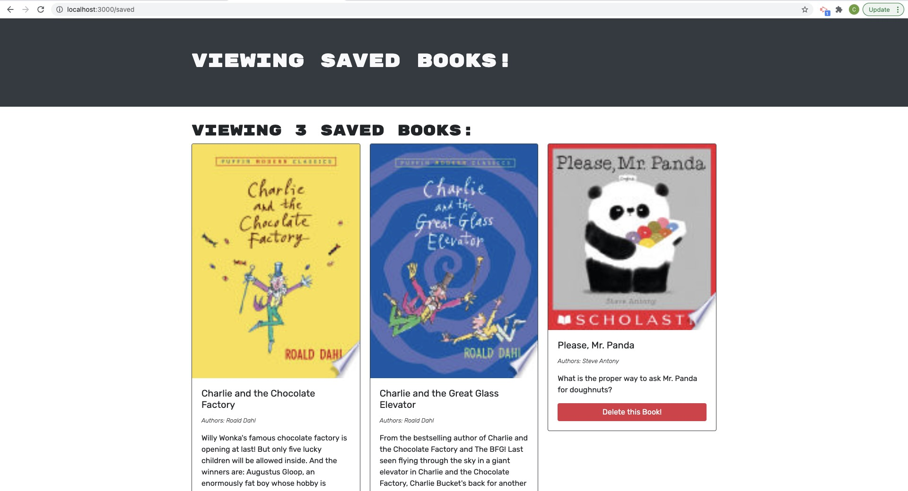

# MERN: Book Search Engine

This project, I took starter code with a fully functioning Google Books API search engine built with a RESTful API, and refactored it to be a GraphQL API built with Apollo Server. The app was built using the MERN stack with a React front end, MongoDB database, and Node.js/Express.js server and API. It's already set up to allow users to save book searches to the back end. 

To complete the assignment, I did the following:

1. Set up an Apollo Server to use GraphQL queries and mutations to fetch and modify data, replacing the existing RESTful API.

2. Modify the existing authentication middleware so that it works in the context of a GraphQL API.

3. Create an Apollo Provider so that requests can communicate with an Apollo Server.

4. Deploy the application to Heroku with a MongoDB database using MongoDB Atlas.

[View deployed Heroku app here](https://desolate-taiga-28989.herokuapp.com/)
- [Installation](#install)
- [Start application](#start-application)


## User Story

```md
AS AN avid reader
I WANT to search for new books to read
SO THAT I can keep a list of books to purchase
```

## Install

Clone project
Run the following line of code in your terminal at the ROOT level to install all the needed packages(make sure you have [node.js](https://nodejs.org/en/download/) installed on your machine):

```
npm i
```

## Start application

Once all the packages have been installed, CD into the SERVER level of the file structure and run the following code in command line :

```
npm run develop
```

This application runs on http://localhost:3000/ open url to begin using Book Search app. A new user should create a login by signing up, then search, save and remove books from the profile as needed. 
## Built With

- HTML
- CSS
- Bootstrap
- React
- JavaScript
- Node.js
  - express
  - mongoose
  - bcrypt
  - jsonwebtoken
  - apollo-server-express
  - graphql

## View





### Credits
Frontend starting files provided © 2021 Trilogy Education Services, LLC, a 2U, Inc. brand. Confidential and Proprietary. All Rights Reserved.

